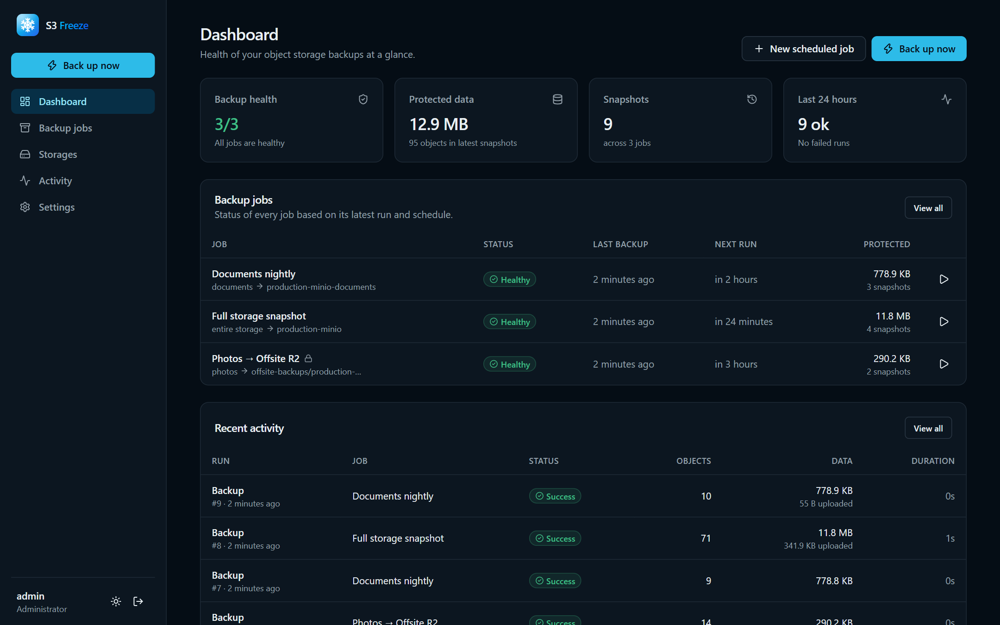
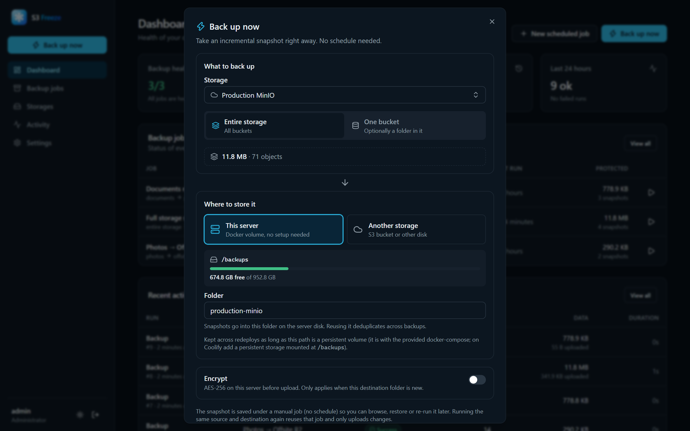
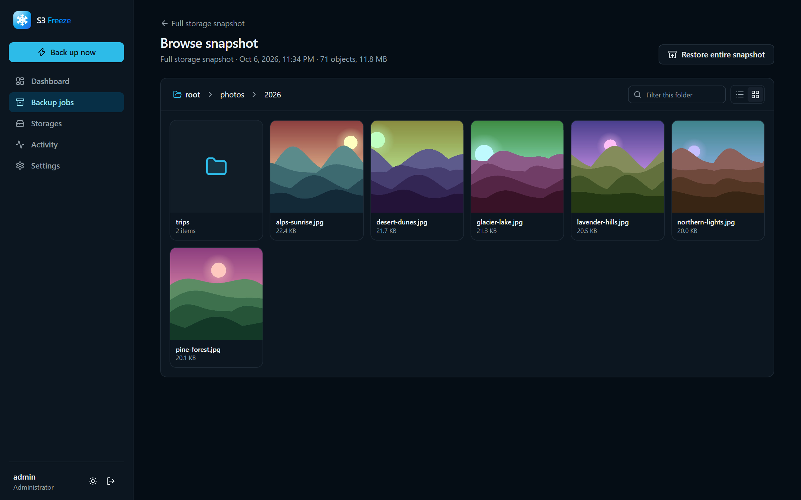
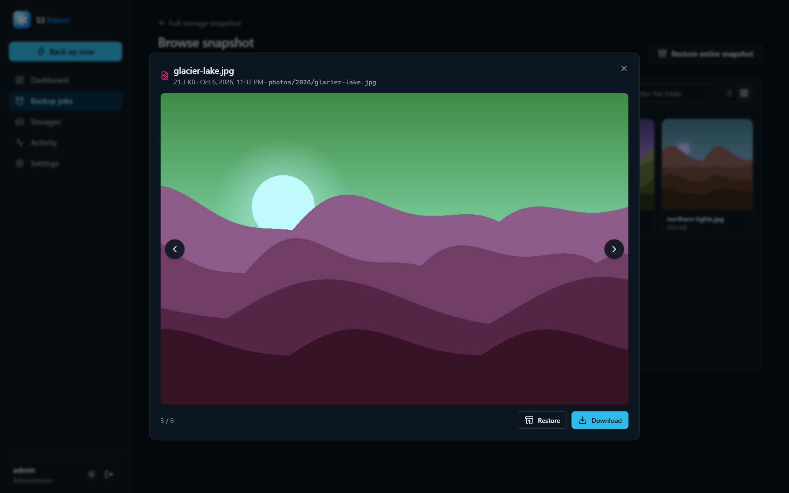
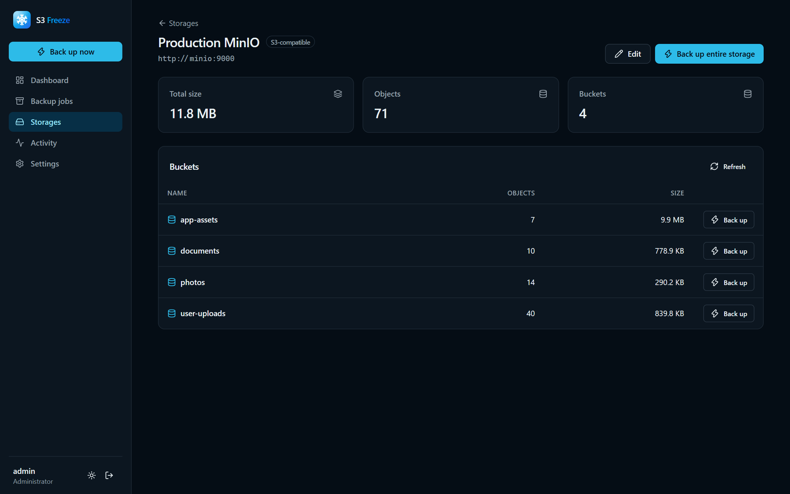
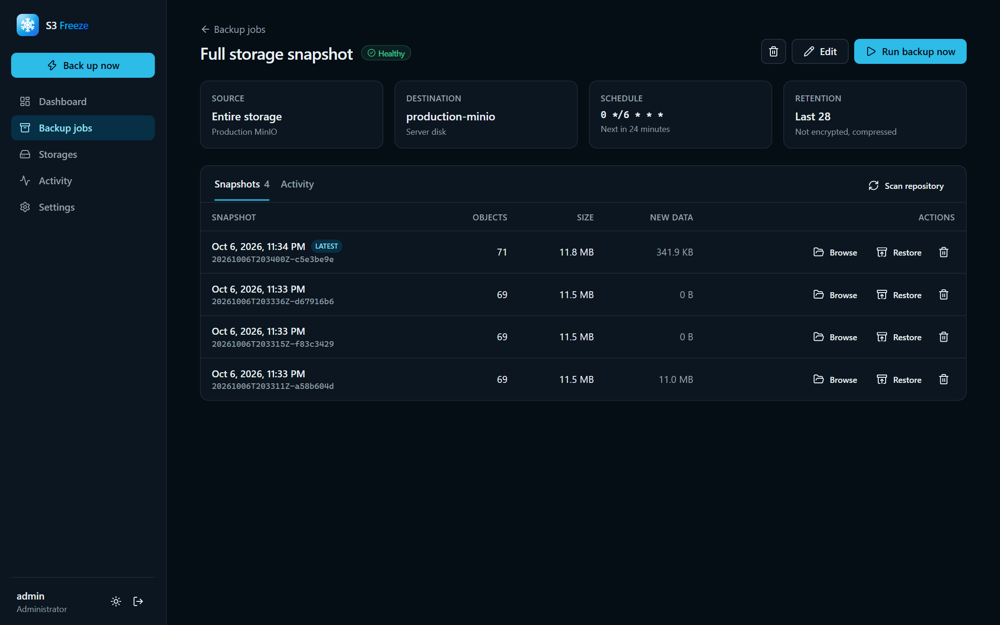
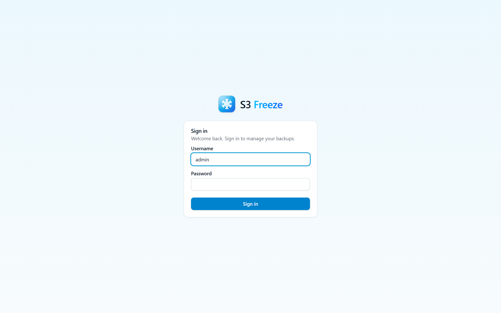

<p align="center">
  <picture>
    <source media="(prefers-color-scheme: dark)" srcset="docs/logo-dark.svg">
    
  </picture>
</p>

<p align="center">
  <b>Freeze your buckets in time.</b><br>
  Self-hosted, incremental snapshot backups for S3-compatible storage — browse them, preview files and restore anything in a click.
</p>

<p align="center">
  <a href="LICENSE"></a>
  
  
  
  
</p>

<p align="center">
  <picture>
    <source media="(prefers-color-scheme: light)" srcset="docs/screenshots/dashboard-light.png">
    
  </picture>
</p>

Works with **MinIO, SeaweedFS, AWS S3, Cloudflare R2, Backblaze B2, Wasabi, Garage, Ceph** — anything that speaks S3.

## ✨ Features

- ❄️ **Incremental, deduplicated snapshots.** Each backup is a complete point-in-time snapshot, yet unchanged objects are never re-downloaded and identical content is stored only once.
- ⚡ **Back up now.** One click to snapshot an entire storage, a bucket or a folder — no job setup required. Scheduled jobs with cron and retention when you want them.
- 🗄️ **Store backups anywhere.** On the server itself (a Docker volume, zero setup), another S3 bucket, or any mounted disk — with live free-space and size estimates.
- 🔍 **Browse & preview.** Explore any snapshot in list or grid view. Images, video, audio and text open in a quick viewer.
- ♻️ **Restore anything.** A single file, a selection of folders or the whole storage — back to the original place (buckets are recreated) or somewhere else.
- 🔐 **Optional client-side encryption.** AES-256-GCM with an Argon2id-derived key; contents, names and metadata are encrypted before they leave the server.
- 🩺 **Health dashboard.** Healthy, failing and stale jobs at a glance, live progress and full run logs.
- 🪶 **Lightweight.** One ~25 MB container: a Go binary with the React UI embedded and SQLite. No external database.

## 📸 Screenshots

| Back up now | Browse a snapshot |
|---|---|
|  |  |
| **Preview files** | **Buckets and sizes** |
|  |  |
| **Snapshot history** | **Sign in** |
|  |  |

## 🚀 Quick start

```sh
docker run -d --name s3freeze -p 8080:8080 \
  -e MASTER_KEY="$(openssl rand -hex 32)" \
  -e ADMIN_PASSWORD="change-me-please" \
  -v s3freeze-data:/data -v s3freeze-backups:/backups \
  ghcr.io/ahmadalhomsi/s3freeze:latest
```

Open http://localhost:8080 and sign in as `admin`. Keep the `MASTER_KEY` value — it encrypts your saved credentials.

Or with Docker Compose: copy `.env.example` to `.env`, fill it in and run `docker compose up -d`.

## ☁️ Deploy on Coolify

1. Push this repository to your Git provider.
2. In Coolify: **New resource → Application → your repo**. Pick **Docker Compose** as the build pack (it uses `docker-compose.yml`), or **Dockerfile**.
3. Set the environment variables (see `.env.example`):
   | Variable | Required | Description |
   |---|---|---|
   | `MASTER_KEY` | recommended | Encrypts stored S3 credentials and job passphrases. Use a long random value (`openssl rand -hex 32`) and keep a copy. If unset, one is generated into `/data/.master_key`. |
   | `ADMIN_USERNAME` / `ADMIN_PASSWORD` | recommended | Creates the admin account on first start. The password is stored only as a bcrypt hash and can be changed later in **Settings**. It is never used to log in directly. |
   | `ADMIN_RESET` | no | Set to `true` once to reset the admin password to `ADMIN_PASSWORD` (e.g. if you forgot it), then remove it. |
   | `TZ` | no | Time zone used for cron schedules (default `UTC`). |
   | `BACKUP_DIR` | no | Folder used by the built-in **Server disk** destination (default `/backups` in Docker). |
   | `TRUSTED_PROXIES` | no | Comma-separated CIDRs whose `X-Forwarded-*` headers are trusted. Defaults to loopback and private ranges, which covers Coolify's proxy. Set `none` when exposing the app directly. |
   | `SECURE_COOKIES` | no | `true` forces the `Secure` cookie flag. This isn't needed behind Coolify's HTTPS proxy, which is detected automatically. |
   | `PORT` | no | Listen port (default `8080`). |
4. Attach a domain and use port **8080**.
5. Make sure both volumes are persistent: `/data` (database and settings) and `/backups` (backups stored on the **Server disk**). The compose file declares both. With the **Dockerfile** build pack, add them under **Persistent Storage** in Coolify.
6. Deploy and open the domain. If you didn't set `ADMIN_PASSWORD`, copy the **setup token** from the logs (**Coolify → Logs**, or `docker logs`) and create the admin account with it.

The container runs as a non-root user on a read-only root filesystem with all capabilities dropped. It has a built-in healthcheck (`/s3freeze healthcheck` → `GET /healthz`).

### Reaching MinIO / SeaweedFS on the same server

If the S3 service runs in Coolify too, connect both resources to the same Docker network. Then use the service name as the endpoint, e.g. `http://minio:9000` or `http://seaweedfs:8333`, with **path-style addressing** enabled.

## 🧭 Using it

1. **Storages → Add storage.** Add the S3 service to back up and use **Test connection** to check credentials. Its page shows every bucket with its size.
2. **⚡ Back up now.** Pick what to back up (the entire storage, one bucket, or a folder) and where to store it. The default destination is **This server**: the built-in *Server disk*, which is the `/backups` Docker volume and needs no setup. You can also send backups to another S3 bucket or disk.
3. **Schedules (optional).** Go to **Backup jobs → New scheduled job** to run backups automatically with retention and encryption. Each run creates a snapshot.
4. **Browse and restore.** Open a job and **Browse** a snapshot in list or grid view. Click any file to preview it: images, video, audio and text open in a small viewer where ←/→ moves between files. You can download single files, select files and folders and click **Restore selected**, or **Restore** the whole snapshot. Restores can overwrite existing objects or skip them.

### Disaster recovery

The repository is self-describing. If you lose the S3 Freeze server, deploy it again, create a job pointing at the same destination with the same passphrase if it was encrypted, and click **Scan repository**. All snapshots are imported and can be restored.

> If you enable encryption, keep the passphrase somewhere safe. Without it, the data cannot be decrypted.

## 🛡️ Security

- **First run.** The first account can only be created with `ADMIN_PASSWORD` or with the one-time setup token from the logs, so nobody else can claim a fresh deployment.
- **Login protection.** After 5 failed attempts an IP is locked out for 15 minutes. After 10 failed attempts against one username (from any IPs) that account is locked for 15 minutes. Failed logins take the same time whether or not the user exists. The whole API is rate limited per IP. Client IPs come from `X-Forwarded-For` only when the request arrives through a trusted proxy.
- **Sessions.** Cookies are HttpOnly and SameSite=Strict, marked Secure over HTTPS, and expire after 7 days. Only a SHA-256 hash of each session token is stored. Changing your password signs out every other session.
- **Passwords and secrets.** Passwords are stored with bcrypt. S3 credentials and job passphrases are encrypted with AES-256-GCM using `MASTER_KEY`.
- **Requests.** State-changing requests need a custom header, which blocks CSRF. Responses carry a strict Content-Security-Policy, HSTS over HTTPS, `X-Frame-Options: DENY` and `nosniff`.
- **Previewing backed-up files.** Content is treated as untrusted. Images, video and audio display inline under a sandboxing CSP. Everything else is shown as plain text or downloaded, so a backed-up HTML or SVG file can never run scripts in the app.

## 🧊 How backups are stored

```
<bucket>/<prefix>/
  config.json            repository id + wrapped encryption key (if encrypted)
  data/ab/ab12…          object contents, addressed by SHA-256 (HMAC-SHA256 when encrypted)
  snapshots/<id>         manifest: every key, size, ETag, mtime, content type, metadata → blob
```

- **Change detection.** An object is skipped when its size, ETag and modification time match the previous snapshot. Everything else is downloaded, hashed and uploaded only if that content isn't already in the repository.
- **Object format.** Every stored object starts with a 6-byte header. The payload is optionally zstd-compressed, then optionally encrypted in 64 KiB AES-GCM chunks (STREAM construction, which detects truncation and reordering).
- **Retention and pruning.** Retention deletes expired snapshot manifests. A prune step then deletes data that no remaining snapshot references. Several jobs can share one repository to deduplicate across buckets.
- **Integrity checks on restore.** Restores re-hash every object and fail it on a mismatch.

## 🛠️ Development

Requirements: Go 1.27+ and Node 22+.

```sh
# backend (http://localhost:8080, data in ./data)
go run ./cmd/s3freeze

# frontend with hot reload (http://localhost:5173, proxies /api to :8080)
cd web && npm install && npm run dev

# production build: UI is embedded into the Go binary
cd web && npm run build && cd .. && go build -o s3freeze ./cmd/s3freeze

# tests (includes an end-to-end run against an in-process fake S3)
go test ./internal/...
```

Project layout:

```
cmd/s3freeze/        entry point (+ `healthcheck` subcommand)
internal/storage/    S3 (minio-go) and local-disk backends
internal/repo/       repository format: blobs, manifests, encryption, prune
internal/engine/     backup / restore / delete / scan runs, snapshot browsing
internal/scheduler/  cron scheduling
internal/store/      SQLite persistence
internal/api/        REST API, auth, embedded UI serving
web/                 React + Vite + Tailwind UI
```

## 📄 License

[MIT](LICENSE) © Ahmad Alhomsi
